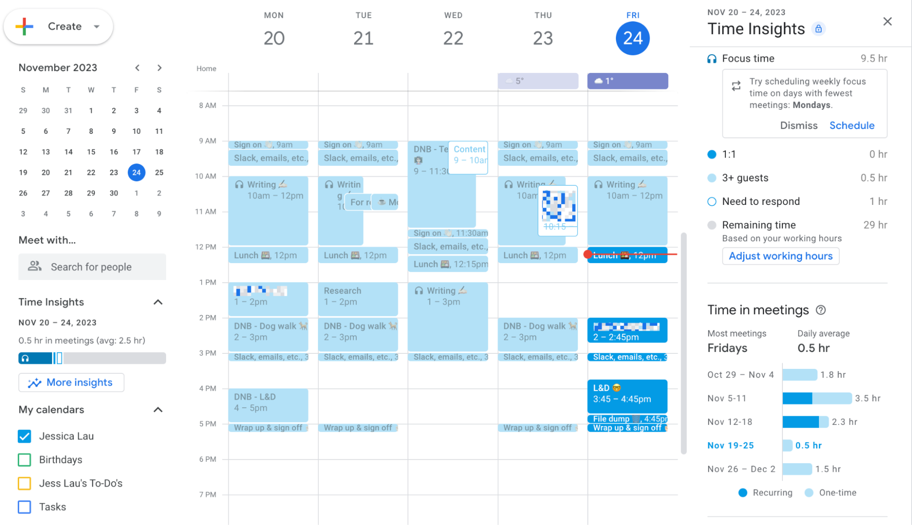
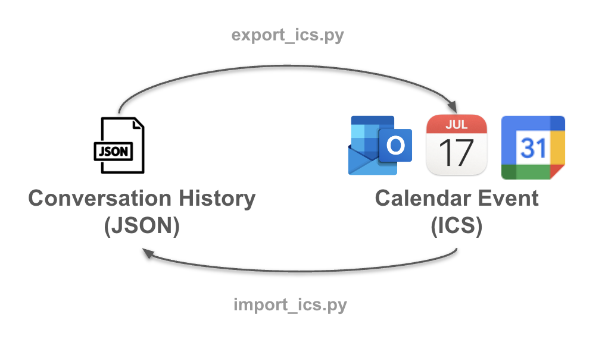

## Chronologue: Time-Stamped Memory Traces with Calendar Integration 🗓️

[](https://developers.google.com/calendar)


**A calendar interface for reviewing and structuring agent memory**

> *Memory systems grounded in user context condition the future distribution of responses that a language model will sample from.*

> *We make ourselves intelligent by designing environments that contain relevant information and make it accessible to our future selves.*  — [Donald Norman](https://jnd.org/)

> *Time is a core substrate for intelligent behavior.* 

### Introduction 

As we develop environments for agents, agents will design environments for us. Enabling this feedback loop between user behavior, interface design, and agent orchestration and scheduling is one of the defining challenges and promises of the next phase of model development. 

We aim to build agents that not only act on our behalf but also structure and store information that are accessible and steerable for developers. That is, we need to focus on designing environments that human users already trust and readily interact with. 

Calendars are a familiar interface for storing event information, planning, and externalizing memory for both individuals and organization. 



This repository converts structured memory traces (stored as `.json`) into `.ics` calendar files, enabling users to visualize and revisit key events — particularly conversation history with language models — within their preferred calendar tools (Apple Calendar, Google Calendar, Outlook).

##### Key Features and Workflow 

- Parses memory trace JSON files from the `data/conversation/raw` folder  
- Validates trace structure against a custom schema  
- Formats `.ics` events with standardized UID, timestamp, and metadata  
- Embeds a summary and direct URL link to the original chat in the event `DESCRIPTION`  
- Outputs `.ics` files compatible with calendar APIs  



---

### Getting Started

1. **Install `uv`**

   If `uv` is not already installed, you can install it using the following command:

   ```bash
   curl -LsSf https://astral.sh/uv/install.sh | sh
   ```

2. **Clone the Repository**

   Clone the repository and navigate into it:

   ```bash
   git clone https://github.com/dr2633/Chronologue.git
   cd chronologue
   ```

3. **Initialize Project with `uv`**

   Initialize the project using `uv`:

   ```bash
   uv init
   ```

4. **Create Virtual Environment**

   Create a virtual environment and activate it:

   ```bash
   uv venv
   source .venv/bin/activate
   ```

5. **Add Core Dependencies**

   Add core dependencies using `uv`:

   ```bash
   uv add "mcp[cli]" httpx
   ```

   (Optional) Install from `requirements.txt` if legacy dependencies exist:

   ```bash
   uv pip install -r requirements.txt
   ```

6. **Set Your API Keys**

   In the `.env` file, set your API keys:

   ```plaintext
   OPENAI_API_KEY=your-openai-key
   CLAUDE_API_KEY=your-anthropic-key
   GEMINI_API_KEY=your-gemini-key
   LLAMA_API_KEY=your-meta-key

   GOOGLE_CLIENT_CREDENTIALS=calendar/credentials.json
   GOOGLE_TOKEN_FILE=calendar/token.json
   ```

   Set your Calendar API for Integration by following the [Google Calendar API setup](https://developers.google.com/calendar/api/quickstart/python).

7. **Convert from JSON Chat History to ICS Format for Calendar**

   Run the following script to transform sample `.json` data to `.ics`:

   ```bash
   python modules/export_ics.py
   ```

   Optional: Generate embeddings for conversation history

   ```bash
   python modules/embeddings.py
   ```

8. **Convert Calendar Data to Model Input**

   Run the following script to transform sample `.ics` files to `.json`:

   ```bash
   python modules/import_ics.py
   ```

In the CLI, you can:

- Load a synthetic user trace
- Build embeddings
- Run a planning query
- Schedule a reminder in your Google Calendar

### System Overview

This system is organized into modular components for:

- **Memory**: storage and structuring of timestamped user traces
- **Calendar**: importing and scheduling events with the Google Calendar API
- **Retrieval**: embedding and FAISS-based similarity search
- **Reasoning**: ReAct-style prompt generation using memory + calendar context
- **Evaluation**: manifold analysis (MMCR) and memory trace logging


See [dataset guide](../data/dataset-guide.md) for more details and description of fields included as part of standardized `.ics` format. 

---

### JSON and Calendar ICS Interoperability 

While this repository enables exporting `.json` memory traces into `.ics` calendar files for visualization and archival, the integration can also work in reverse.


By ingesting `.ics` files from tools like Google Calendar or Apple Calendar, agents can:

- Ground responses in the user’s actual schedule and past events  
- Retrieve relevant context by aligning timestamps and event metadata  
- Prioritize upcoming tasks or recall prior interactions based on calendar entries  

This workflow allows for persistent, time-aware context grounding, enabling language models to condition outputs based on a user’s routines, workflows, and past conversations.

--- 

### Example: Model Output Converted to iCalendar Format
Suppose a model generates the following JSON:
```json
{
  "title": "Project Sync: Inference Pipeline",
  "description": "Check progress on GPU inference benchmarks.",
  "start": "2025-04-11T14:00:00Z",
  "end": "2025-04-11T14:30:00Z",
  "location": "https://zoom.us/my/benchmark-sync",
  "organizer_email": "agent@memorysystem.ai"
}
```
You would translate this to:
```ics
BEGIN:VEVENT
DTSTART:20250411T140000Z
DTEND:20250411T143000Z
SUMMARY:Project Sync: Inference Pipeline
DESCRIPTION:Check progress on GPU inference benchmarks.
LOCATION:https://zoom.us/my/benchmark-sync
UID:project-sync-20250411@memorysystem.ai
DTSTAMP:20250410T230000Z
ORGANIZER;CN=Memory Agent:mailto:agent@memorysystem.ai
STATUS:CONFIRMED
TRANSP:OPAQUE
END:VEVENT
```


